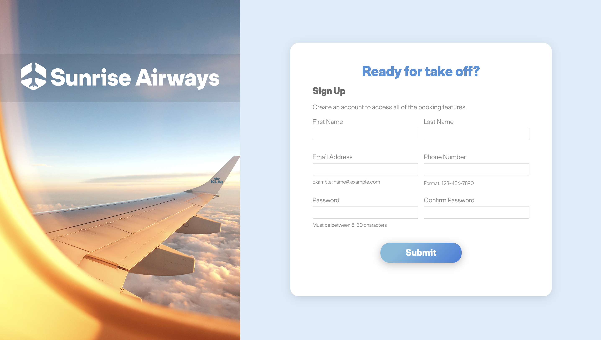
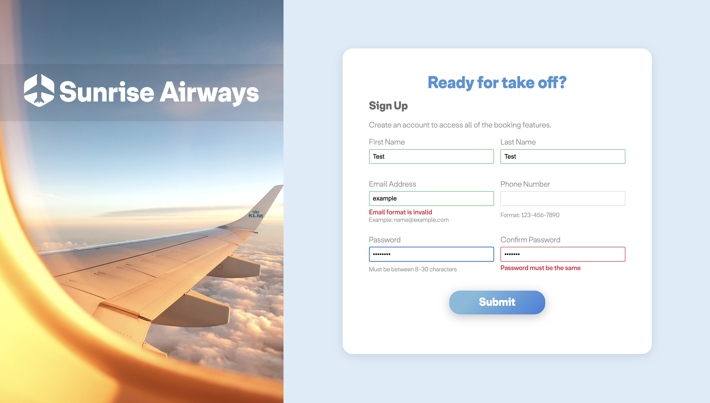

# Sign-Up Form
A sign up form designed for an Airways services to practice using HTML forms and best practices. View it [here!](https://natasha-a.github.io/etch-a-sketch/)

## Objective
* Practice HTML forms to utilize various elements and attributes to create effective forms
* Learn how to style forms using CSS to enhance UX/UI 
* Incorporate form validation using built-in HTML form features and Javascript for more complex formatting validation
* Responsive design for desktop and mobile views

## Sample Views 

## Learning Outcomes 
* Strong understanding of HTML form syntax and attributes
* Ability to style forms using advanced CSS concepts such as CSS variables, functions, and attribute selectors
* UX/UI concepts practiced for clean and intutitive form layout 
* Responsive design using media queries and break-points
* HTML and Javascript client-side form validation 
